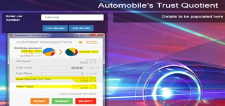
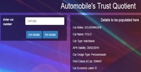
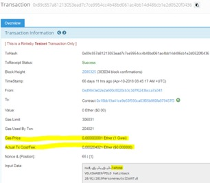

# Automobile Trust Quotient
Create a platform which will digitally track and trace the history of an automobile (cars, trucks, buses, any vehicle et al) with inherent immutability on a blockchain, which will aid buyers to take informed decision and sellers to position their automobile better in the marketplace. Producers and Consumers of the platform will be various buyers, sellers, garages, part providers, paarts and car manufacturers, goverment bodies maintaining automobile periodic check and registration data"

In order to use this digital online immutable distributed ledger of information on automobiles, incentives will be given to all producers and consumers.

Once implemented:
Buyers can: Trust the information as it cannot be tampered and is available real time
Sellers can: Go to the market directly and get a good price, Keeping up the health of the car for a sustainable environment

# What problem this innovation is trying to solve?
From a retail consumer standpoint: The automobile market for second hand cars is enormous. This idea addresses two customer viewpoints, one the buyer, other the seller.

Today, when people go to buy a car:
 1) They look at the service book for a car for the service history
 2) Drives the car around to get a feel of it
 3) Takes the car to a garage, pays and gets it checked
 4) Searches websites and try and get paid reports
Based on the above factors, evidence and gut, the buyer decides, for or against buying the car
Even after this, buyers often get a short term protection insurance, adding further onto the cost of buying the car.
The extra cost that the buyer pays is 5-10%.

When cars are sold:
 1) Garages charge a percentage of the selling price of the car to the seller
 2) Lot of elements are fixed momentarily to just sell the car
 3) Authenticity of parts cannot always be determined

# The Implementation (with usecase)
- Retrieval of publicly available car maintenance details and perform storage and retrieval of information from a public distributed ledger (blockchain) with payment with ETH (Ether).
- Scope is limited to the automobiles in The Netherlands and the API's of RDW is used
- Once the platform is democratized, further countries and parties can be added
- A smart contract has been created with the shared code on the test ethereum blockchain ```https://rinkeby.etherscan.io/tx/``` and the address for the same is in the html code as ```0x18bb19a41ce9e53f556ca03f05b860fa879457f3```

+ **Data Check**

 

+ **Proof of entry in Etherium Blockchain**


# How to extend/modify this
The smart contract code is shared, feel free to fork it, create your new implementation and create a new contract on the blockchain. Once this is complete, replace the new generated address in the html file with the existing smart contract address ```0x18bb19a41ce9e53f556ca03f05b860fa879457f3```. Modify the HTML code as needed. You can also change the test blockchain network from ```https://rinkeby.etherscan.io/tx/``` to others as deemded suitable.

# Technology Stack
- Smart Contracts
- Solidity
- Etherium Blockchain (public Testnet)
- Cars Netherlands API’s by RDW
- Javascript, CSS, HTML
